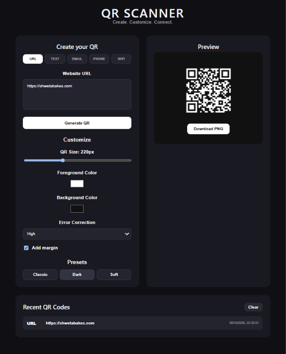
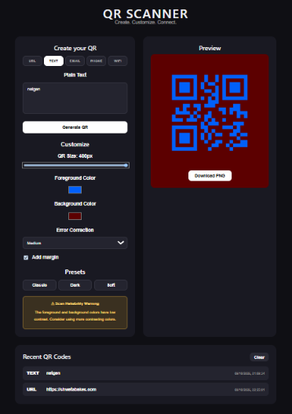
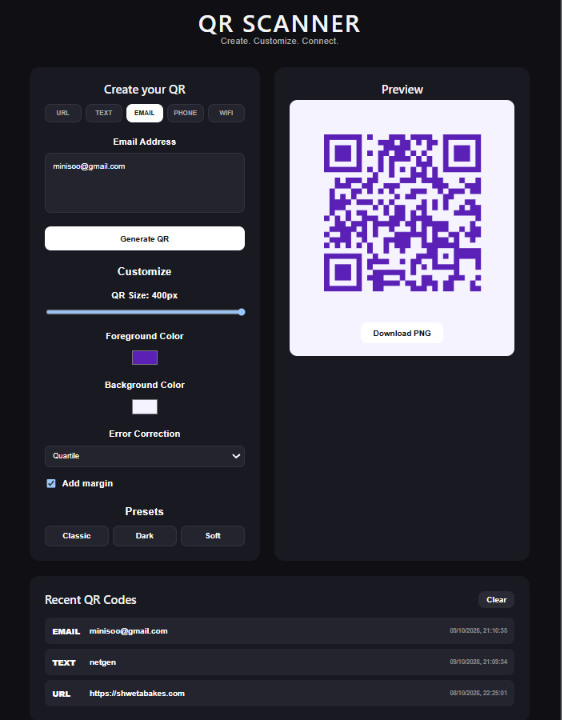
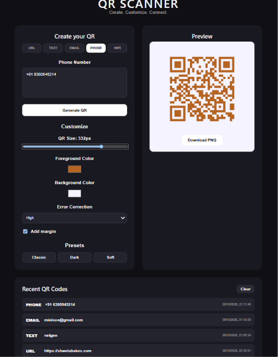
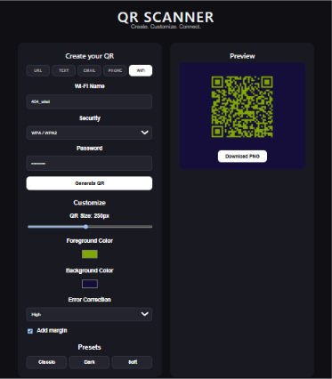
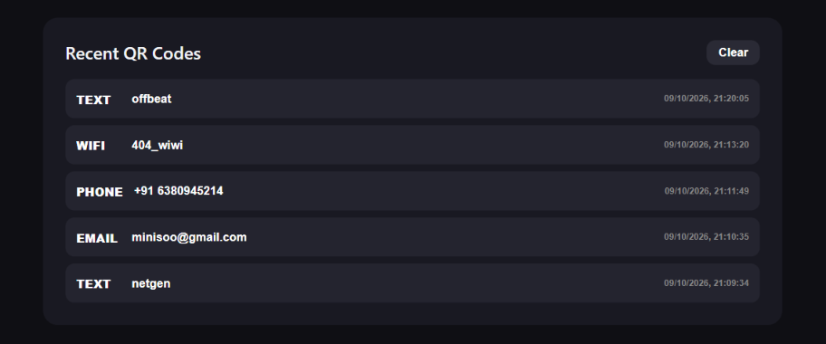

# QR SCANNER — Create. Customize. Connect.

A responsive QR Code Generator and Designer built with React and Vite. Create QR codes for different types of information, customize their appearance, preview them instantly, and download them as PNG images.

## Features

- **Multiple QR Types:** Generate QR codes for URLs, plain text, email addresses, phone numbers, and Wi-Fi networks.
- **Customization:** Adjust QR code size, foreground color, background color, error correction level, and margins.
- **Preset Styles:** Quickly apply Classic, Dark, and Soft presets.
- **Live Preview:** Preview your generated QR code before downloading.
- **PNG Download:** Download generated QR codes as PNG images.
- **Recent QR Codes:** Keep track of recently generated QR codes using browser local storage.
- **Input Validation:** Validate inputs based on the selected QR code type.
- **Scan Reliability Warning:** Receive a warning when the selected QR styling may affect scan reliability.
- **Responsive Design:** Use the application on desktop and mobile screens.

## Tech Stack

- React
- Vite
- JavaScript
- HTML5
- CSS3
- `qrcode.react`
- Browser Local Storage

## Getting Started
The application will be available at:

Local: http://localhost:5173/

Network: http://192.168.1.2:5173/

The local URL opens the app on your computer. The network URL lets you access it from another device connected to the same Wi-Fi network while the development server is running.

### Prerequisites

- Node.js
- npm

### Installation

1. Clone the repository:

   ```bash
   git clone https://github.com/shwetashwe2703-glitch/qr-code-generator.git
   ```

2. Navigate to the project directory:

   ```bash
   cd qr-code-generator
   ```

3. Install dependencies:

   ```bash
   npm install
   ```

4. Start the development server:

   ```bash
   npm run dev
   ```

5. Open the local URL displayed in your terminal.

## Screenshots

### Main Interface


### Text QR Code


### Email QR Code


### Phone QR Code


### Wi-Fi QR Code


### Recent QR Codes


## Project Structure

```text
qr-code-generator/
├── public/
├── src/
├── screenshots/
│   ├── main-interface.png
│   ├── text-qr.png
│   ├── email-qr.png
│   ├── phone-qr.png
│   ├── wifi-qr.png
│   └── qr-history.png
├── index.html
├── package.json
└── README.md
```

## Future Improvements

- Export QR codes in SVG format.
- Add logo support and gradient customization.
- Improve QR code history restoration for all QR types.
- Add more customization presets and accessibility improvements.

## Author

**Shweta**

GitHub: [@shwetashwe2703-glitch](https://github.com/shwetashwe2703-glitch)

---

Built as a frontend project to explore interactive UI design, QR code generation, and browser-based storage.
